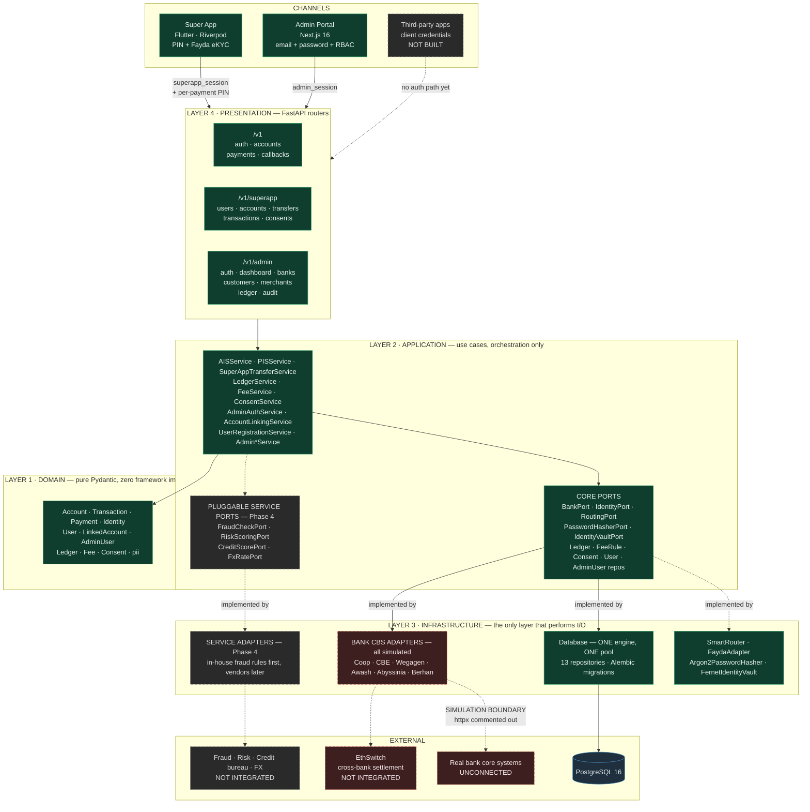
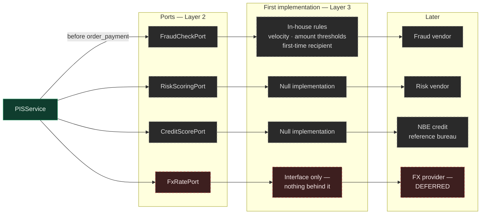
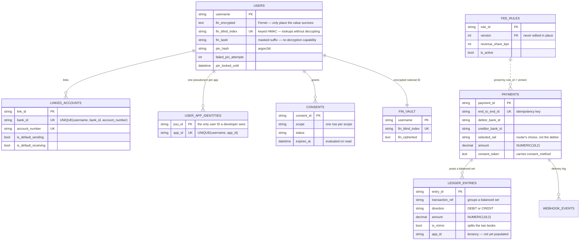
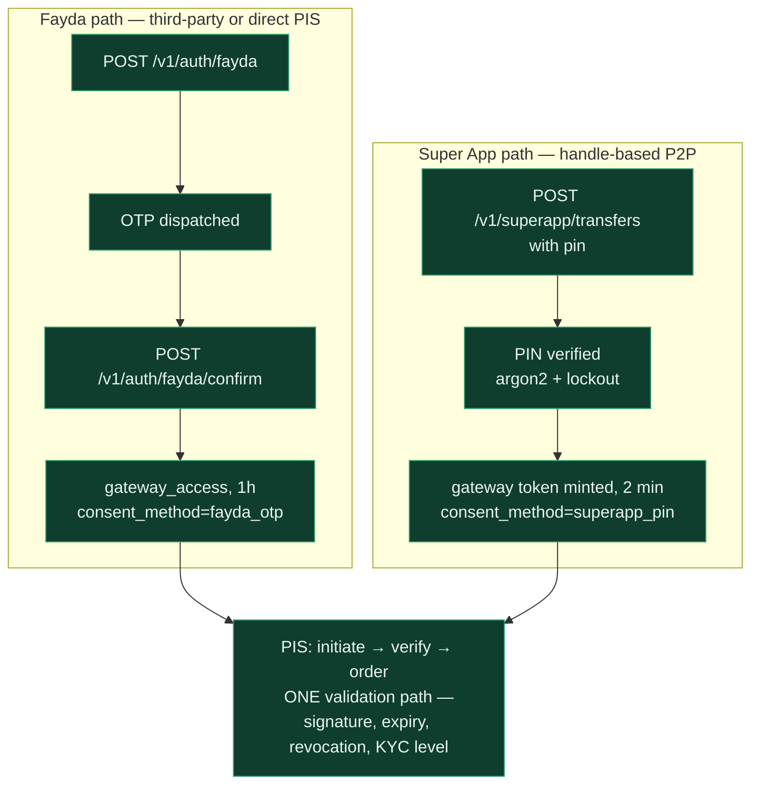
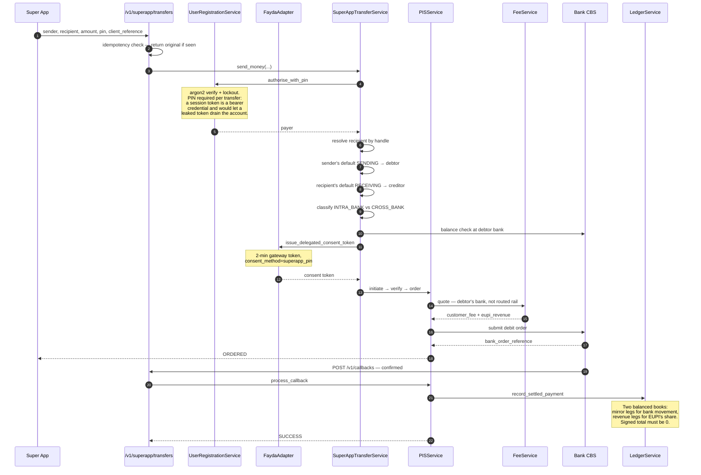
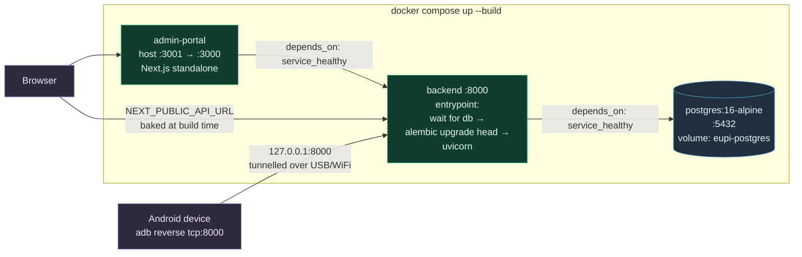

# EUPI — System Architecture

Cross-system reference for the three EUPI repositories: the FastAPI gateway, the
Next.js admin portal, and the Flutter super app.

> This is the version-controlled copy. An identical file sits one directory
> above the three repositories for convenience when working across all of them;
> that location is not a git repository, so this is the authoritative one.

---

## 1. What EUPI is

A **payment and identity platform** for Ethiopia, with three surfaces:

| Surface | What it does |
|---|---|
| **Gateway** | Standardised AIS + PIS over multiple Ethiopian bank rails, Fayda eKYC, fee engine, double-entry ledger |
| **Super App** | Consumer app: aggregated balances, handle-based P2P, merchant payments |
| **Admin Portal** | Internal operations: rails, customers, merchants, pricing, reconciliation, audit |

### One naming correction worth making

The repository currently markets itself as *"Ethiopia's first unified **Open
Banking** API standard."* For the developer-facing product, that is no longer
accurate and should be changed.

The developer API exposes **EUPI's own transaction ledger**, not bank data
brokered with consent. That moves it out of Tink's category (which requires bank
agreements and AISP licensing) and into Stripe/PayPal's. This is a *better*
position — it removes banks from the critical path of the developer product — but
claiming open banking invites a standard EUPI does not meet and regulatory
attention it does not need. Open banking becomes a later phase, when banks sign.

---

## 2. System overview

Status is marked throughout: **solid** = built and verified, **dashed** = not yet
built, **red** = blocked on something outside engineering.



Two things this is meant to make obvious:

1. **The bottom edge is closed.** Every bank rail is a simulation. For a sandbox
   product that is the correct answer — it is what Stripe and Tink both ship — but
   no live CBS integration exists, and that gates all revenue.
2. **The top-right edge has no door.** Third-party developers cannot
   authenticate. `/v1` exists but there is no client-credentials flow, no `app_id`
   tenancy scoping, and no rate limits.

### Pluggable services — the Phase 4 seam

The dashed `PLUG` group is the extension point for capabilities EUPI will not
build itself. It is cheap precisely because the hexagonal design already exists:
each is a port alongside `BankPort`, so swapping an in-house implementation for a
vendor touches one adapter and no use case.



`FraudCheckPort` is the only one with real work behind it: it wires into the
payment flow **before** `order_payment`, so a blocked payment never reaches the
bank. The rest exist so the seam is not a rewrite later.

**`FxRatePort` is deliberately empty.** Ethiopian forex is tightly controlled and
cross-border remittance is a separate licence and a separate business. The
interface should exist; nothing should be built behind it until that is a
deliberate decision.

---

## 3. Clean Architecture, and why it held up

Dependency arrows point **inward**. Layer 1 imports nothing. Layer 2 depends only
on ports it defines. Layer 3 implements those ports. Layer 4 calls Layer 2.

This is worth stating because it paid for itself: adding a ledger, a fee engine,
a consent system, and a national-ID vault was **almost entirely additive**.
Roughly 85% of existing code was untouched or extended, ~10% mechanical
refactor, ~5% rewrite. Had the routes talked directly to SQLAlchemy and httpx,
the same work would have been a rewrite.

The domain vocabulary also already anticipated the developer platform:
`DeveloperApp` carries `client_id` and `allowed_scopes`, and `KYBRequest`,
`Merchant`, `WebhookLog`, and `AuditLog` all exist. Those are designed seams
waiting to be filled, not new ones to cut.

---

## 4. Data model



Other tables: `admin_users`, `consent_tokens`, `bank_configurations`,
`merchants`, `developer_apps`, `kyb_requests`, `audit_logs`, `alembic_version`.

### Three decisions worth understanding

**The national ID is three columns, not one.** `users.fin` used to be plaintext,
indexed, and unique — so anyone who obtained the table obtained every citizen's
Fayda number. It is now `fin_encrypted` (Fernet ciphertext, the only place the
value survives), `fin_blind_index` (a **keyed** HMAC, so equality lookups need no
decryption), and `fin_last4` (the masked suffix). That third column is
least-privilege: the admin analytics repository reads it and has **no decryption
capability at all**, so an operator browsing the customer list cannot obtain a
full national ID through that path even if the presentation layer forgot to mask.

The index must be keyed, not a bare hash. A 14-digit FIN has a 10¹⁴ keyspace; a
plain SHA-256 of one is brute-forceable offline by anyone holding the table.

**The ledger holds two independent books.** Because EUPI operates on revenue
share and never holds customer funds:

- **Mirror entries** (`is_mirror=true`) record value that moved *at the banks*.
  EUPI never controlled it. They answer "what did we orchestrate?"
- **Revenue entries** are EUPI's own receivable and recognised income.

Each balances to zero separately, and reconciliation never nets them — a number
mixing "money we moved" with "money we're owed" means nothing.

**Fee rules are versioned, never updated.** A price change publishes version N+1
and retires N. Every payment records the exact `rule_id` and `version` that
priced it, so re-running last quarter's report produces last quarter's prices.

---

## 5. Authentication and token types

Four token types. **Every decoder asserts its exact type** — this is load-bearing,
not defensive style. Without it a Super App session token (which carries
`sub`/`jti`/`scopes`/`kyc_level`) validates as a gateway AIS/PIS token and grants
access to banking endpoints it was never issued for.

| Type | Issued by | Authorises | TTL |
|---|---|---|---|
| `gateway_access` | Fayda OTP, or a PIN authorisation | AIS reads, PIS payments | 1h / 2min |
| `superapp_session` | PIN login | Super App endpoints — **not payments** | 1h |
| `registration_verification` | OTP during signup | Completing registration | 15min |
| `admin_session` | Operator login | Admin API, gated by role | 8h |

### Consent for a payment



Both paths produce a real signed gateway token, tracked for revocation and
carrying a KYC level, so `PISService` has **one** validation path rather than a
second weaker branch.

The PIN is required **per transfer**, not once per session. A session token is a
bearer credential valid for an hour; accepting it as payment authorisation would
make a leaked token sufficient to drain an account — a weaker bar than the OTP it
replaces. The `consent_method` claim records which path was used, because a
PIN-authorised payment and an OTP-authorised one are not equivalent evidence.

---

## 6. Handle-based P2P

The flow the platform is really about: two usernames and an amount in, four
banking details derived.



`INTRA_BANK` matters strategically: both accounts in one CBS is an internal book
transfer needing **no interbank settlement**, so it is the case that can go live
with a single bank agreement. It is priced separately for the same reason.

The debit account is **not** selectable by the client. The server resolves it
from the sender's default, so a UI offering a choice would let a user select one
bank and watch another be debited.

---

## 7. Deployment



**Migrations run in the entrypoint, not application startup.** A failed migration
stops the container rather than leaving a process serving against a half-migrated
schema.

**Postgres, not SQLite,** for two concrete reasons: SQLite serialises writers
behind a single lock (measured: 20 concurrent reads in 312ms and 10/10 concurrent
writes on Postgres — SQLite would queue them), and it has no real decimal type,
while the ledger needs exact `NUMERIC(18,2)` arithmetic.

`create_all()` no-ops when it detects `alembic_version`, so the two schema
mechanisms cannot fight.

The portal maps to host **3001** because a local `next dev` usually owns 3000.
`NEXT_PUBLIC_API_URL` is inlined at build time and must be the *browser's* URL.

### Device testing

```
adb connect <device-ip>:<port>          # wireless debugging (port rotates)
adb reverse tcp:8000 tcp:8000           # device localhost:8000 → host
```

The app targets `127.0.0.1:8000`, tunnelled through adb.

---

## 8. Competitive position

EUPI overlaps three different kinds of company, and no one of them describes it.

| | What it fundamentally is | Money custody |
|---|---|---|
| **UPI** | National payment *standard + switch* (NPCI, RBI mandate) | Never holds funds |
| **Tink** | *Middleware* over existing PSD2 bank APIs | Never holds funds |
| **PayPal** | Closed-loop *network + wallet* | Holds funds; is the counterparty |
| **EUPI** | All three at once | Never holds funds — pass-through |

**Closest to UPI** in shape: handle-based addressing (`username@eupi` ≈ VPA),
national ID as the identity root (Fayda ≈ Aadhaar), multi-bank linking with
defaults, a central switch. **The critical difference is mandate.** NPCI is
bank-owned under RBI authority, so banks *had* to connect. EUPI is a private
platform hoping they will — which is why six adapters are still mocks, and it is
the largest non-technical risk.

**Closest to Tink** in product: one clean API over many banks' incompatible
interfaces. The `_normalise_account` methods in each adapter are Tink's entire
engineering thesis in miniature. But Tink integrates against APIs banks were
*legally forced* to build; Ethiopia has no PSD2 equivalent.

**Closest to PayPal** in developer surface: OAuth2 client credentials, sandbox,
webhooks, KYB onboarding. But PayPal is closed-loop and holds your money; EUPI is
strictly pass-through orchestration — no ledger of customer funds, no float. A
much lighter regulatory posture.

**Unique to EUPI:** the Smart Router. UPI routes deterministically to the payee's
bank; Tink connects to whichever single bank you name; PayPal routes internally.
Nothing else scores banks as interchangeable rails on live uptime, latency, and
cost with circuit breaking. Honest caveat: for most payments you cannot choose
which bank holds the recipient's money, so its real applicability today is
funding-side selection.

---

## 9. Where this stands

### Done and verified

Real admin authentication with RBAC · argon2id PINs with lockout · token-type
separation · FIN encrypted at rest with a keyed blind index · per-app pseudonyms ·
consent with per-scope revocation · double-entry ledger balancing to zero ·
versioned fee engine · per-bank reconciliation · Postgres with Alembic · one
engine across 13 repositories · PIN-authorised P2P with idempotency · 100 tests ·
Dockerised stack · Super App journey driven on a physical device

### Gated on a bank agreement

Everything that earns revenue. No amount of engineering unblocks it. The
architecture is arranged so that when the first bank signs, going live is an
adapter swap behind `BankPort` — weeks of integration, not months of
re-architecture.

**Intra-bank first** is the wedge: same-CBS transfers need no interbank
settlement, so one agreement yields a complete live product for that bank's
customers.

### Not built

- **Developer platform** — no TPP authentication, no `app_id` tenancy scoping, no
  rate limits, no client credentials. `app_id` columns exist in preparation. The
  tenancy scoping is the highest-risk change remaining: one missed query filter
  leaks one developer's data into another's.
- **Cross-bank settlement** — should interoperate with EthSwitch rather than
  rebuild national interbank settlement.
- **Pluggable services** — fraud, risk, credit scoring, FX. Architecturally cheap
  given the existing ports; strategically useful for the platform story.
- **Mini-app platform** — third parties listed as apps in the Super App. This is
  the answer to "why integrate with EUPI rather than the bank directly?":
  distribution.
- **Structured logging, CI, key rotation.**

### Two questions for counsel, not engineering

- Does orchestration-plus-revenue-share itself trigger NBE payment-operator
  licensing?
- Does the pseudonymity design satisfy Ethiopia's personal data protection
  regime? It is built to be defensible, but that judgement is not engineering's
  to make.

These run on legal timelines rather than sprint timelines, so they are worth
starting early.
